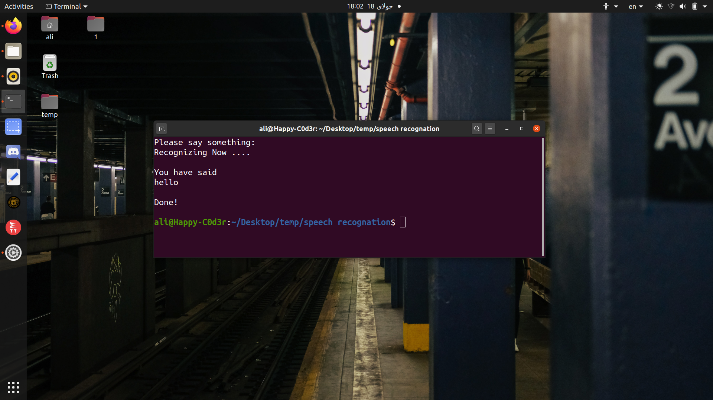

# Speech Recognition

## Description
a little script for speech recognition with python.

## Table of Contents
* [Installing](https://github.com/ali-moments/speech-recognition#installing)
* [Usage](https://github.com/ali-moments/speech-recognition#usage)
* [ScreenShot](https://github.com/ali-moments/speech-recognition#screenshot)
* [Contributing](https://github.com/ali-moments/speech-recognition#contributing)
* [Credits](https://github.com/ali-moments/speech-recognition#credits)
* [License](https://github.com/ali-moments/speech-recognition#license)

## Installing
```bash
sudo apt install git
git clone https://github.com/ali-moments/speech-recognition.git
cd speech-recognition
sudo chmod +x install.sh
sudo ./install.sh
```

## Usage
just run it with python3
```bash
python3 speech-recognition.py
```

## ScreenShot


## Credits
Ali-AAA
[](https://t.me/happy_c0d3r)
[](https://www.instagram.com/ali_aaa_3351/)

## License

